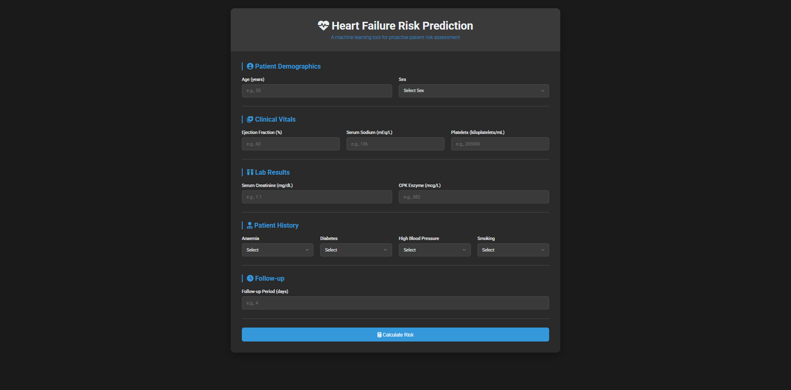

# Heart Health Assessment Tool  

A web-based solution designed for evaluating heart failure risk using machine learning models.

---

## Project Overview  

The Heart Health Assessment Tool is developed to assist healthcare professionals and individuals in predicting the likelihood of heart failure through clinical and medical data analysis. This application integrates a machine learning model with a user-friendly interface built using the Flask web framework.

---

## How It Works  

1. Users provide patient demographic and clinical details through the web interface.  
2. The backend processes the input data and utilizes a RandomForestClassifier model for prediction.  
3. The system analyzes the data and classifies the patient’s risk as either low or high.  
4. The prediction result is displayed immediately on the interface.  

---

## Key Features  

### Machine Learning  

- Model: RandomForestClassifier  
- Achieved Accuracy: 83.33%  
- Libraries: Pandas, NumPy, Scikit-learn  

### Frontend  

- Clean and responsive dark-themed interface  
- Simplified forms for entering clinical and patient data  

### Backend  

- Developed using the Flask framework  
- Optimized for fast and reliable predictions  

---

## Application Preview  

### Main User Interface  

  

---

## Example Predictions  

### Low Risk Result  
  

### High Risk Result  
  

---

## Technology Stack  

- Backend: Python, Flask  
- Machine Learning: Scikit-learn, Pandas, NumPy  
- Frontend: HTML, CSS  

---

## How to Run the Project Locally

Follow these steps to set up and run the project on your local machine:  

### 1️⃣ Clone the Repository
```bash
git clone https://github.com/Joel-77524/Heart-Health-Assessment-Tool.git
cd Cardiac-Risk-Analyzer
```

### 2️⃣ Create and Activate a Virtual Environment

**For macOS/Linux:**
```bash
python3 -m venv venv
source venv/bin/activate
```

**For Windows:**
```bash
python -m venv venv
.\venv\Scripts\activate
```

### 3️⃣ Install Dependencies
```bash
pip install -r requirements.txt
```

### 4️⃣ Run the Flask Application
```bash
python app.py
```

### 5️⃣ Access the Application
Open your browser and go to:  
[http://127.0.0.1:5000](http://127.0.0.1:5000)

You should now see the application running and ready for predictions.

---

## Author

**Joel Biju**  
[GitHub - Joel-77524](https://github.com/Joel-77524)
